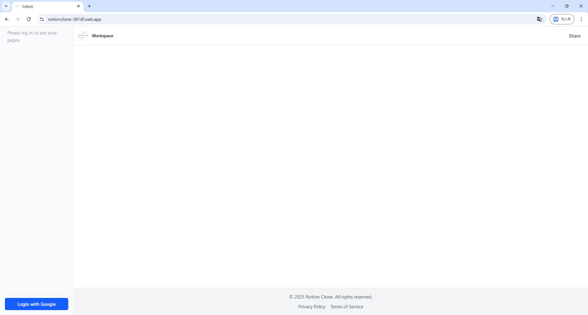
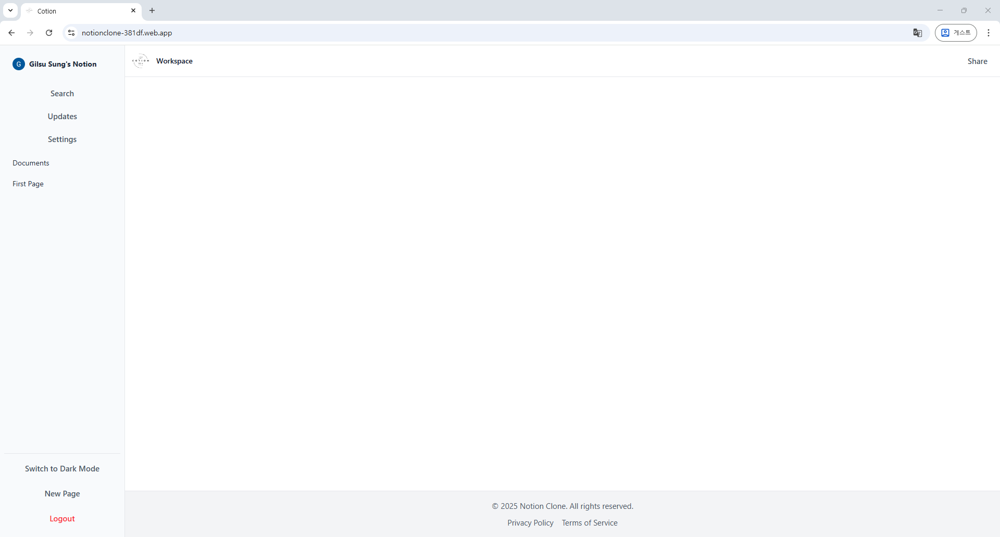

# WWGS-Cotion (Notion Clone Project)

이 프로젝트는 노션의 클론 코딩을 구현하며 Vue 3, Vite, Tailwind CSS, NestJS, WASM, PostgreSQL, Firebase Authentication, AWS (EC2, RDS, S3) 기술 스택을 학습하고 연습하기 위해 제작중인 개인 프로젝트입니다. Vite를 기반으로 한 Vue 3 & Tailwind CSS 프론트엔드와 Rust로 작성된 WASM 모듈을 통합하고, Firebase 인증을 구현하며, 최종적으로는 AWS에 배포하는 전체 과정을 경험하는 것을 목표로 합니다.

자세한 개발 로드맵과 학습 과정에서 겪은 실수들은 `docs` 폴더에 기록되어 있습니다.

---

## 🚀 임시 페이지

👉 [배포된 데모 바로가기](https://notionclone-381df.web.app/)

---

## 🌒 현재 구현된 화면




---

## 🌕 목표하는 주요 기능

- **기본 화면:** 전반적인 레이아웃은 Notion을 따릅니다. 다만 일부는 기술적 한계와 학습 목표 때문에 수정이 필요할 수도 있습니다.
- **Document 지원:** 기본적인 글 단위를 Document라고 합니다. Document는 Document 여러개를 포함할 수 있습니다.
- **Document 렌더링:** Root Documents를 불러오는 API를 만들고, 불러온 Documents에 하위 Document가 있는 경우, 해당 Document 아래에 트리 형태로 렌더링 합니다.

---

## ✨ 주요 학습 과정

- **UI/UX 제작:** HTML5와 CSS3를 이용해 기본적인 화면의 뼈대를 만들고 Vue 3과 Tailwind CSS로 원본 Notion과 닮은 반응형 레이아웃을 만듭니다.
- **Light/Dark 모드 지원:** CSS 변수와 `localStorage`를 이용한 Light/Dark 모드 전환 및 유지를 지원합니다.
- **Rust(WASM) 연동**: Rust로 작성된 함수를 Vue 3에서 호출하여 일부 작업의 병목을 줄입니다.
- **Firebase 인증**: 이메일/비밀번호 및 Google 소셜 로그인을 통한 사용자 인증을 지원합니다.
- **AWS 배포:** 본격적인 접속이 가능하도록 AWS (EC2, RDS, S3)에 배포합니다.

---

## 🛠️ 기술 스택

- **Frontend**: `Vue 3`, `TypeScript`, `Vite`, `Pinia`
- **WASM**: `Rust`, `wasm-pack`, `wasm-bindgen`
- **Authentication**: `Firebase Authentication`
- **Styling**: `Tailwind CSS`
- **Deployment**: `Firebase Hosting` (현재), `AWS S3/CloudFront` (목표)
- **Package Manager**: `npm` (또는 `pnpm`)

---

## 📁 프로젝트 구조

[treeWithoutNodeandWASM.txt](./docs/treeWithoutNodeandWASM.txt) 참조

---

## 🚀 시작하기

### 1. 의존성 설치

```sh
npm install
```

### 2. WASM 모듈 빌드

```sh
npm run build:wasm
```

### 3. Type-Check 및 Vite 빌드

```sh
npm run build
```

### 4. 개발 서버 실행

```sh
npm run dev
```

### 5. Lint with [ESLint](https://eslint.org/)

```sh
npm run lint
```

---

## 📝 학습 기록

이 프로젝트의 핵심 목표는 '학습'입니다. 개발 과정에서 발생한 모든 실수와 해결 과정, 세션별 작업 내용은 `docs` 폴더에 상세히 기록하고 있습니다.

- [세션 로그](./docs/session_logs.md)
- [날짜 별 실수 및 해결 기록](./docs/days/)

---
